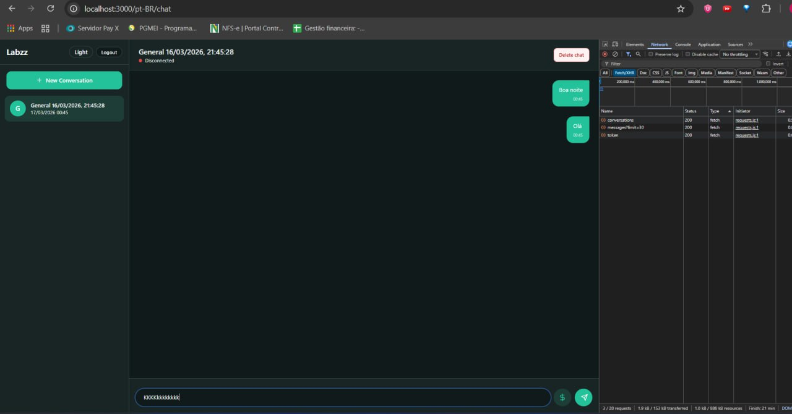
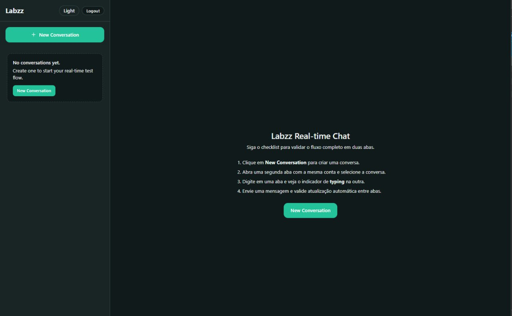
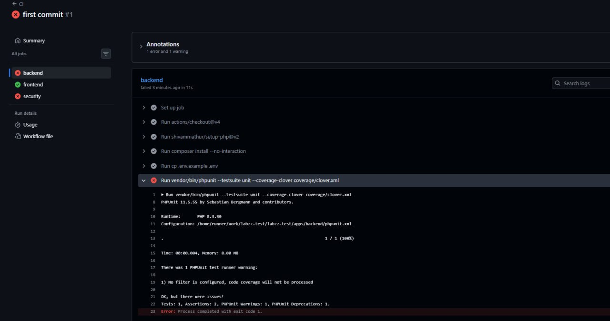
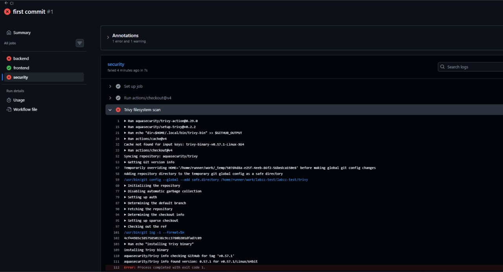

# labzz-test

Sistema de chat real-time fullstack para avaliação técnica.

## Stack
- **Backend:** PHP 8.3 (monolito), MySQL, Redis, Elasticsearch, OpenSwoole
- **Frontend:** Next.js 15 + TypeScript + Tailwind + i18n (pt-BR/en)
- **Mobile (bônus):** Expo scaffold
- **Infra:** Docker Compose, CI básico, OpenAPI, Postman, k6

---

## 1) Pré-requisitos
- Docker Desktop ativo
- Git
- Conta Auth0 (tenant + aplicação + API)

---

## 2) Clonar e entrar no projeto
```bash
git clone git@github.com:altencirsilvajr/labzz-test.git
cd labzz-test
```

---

## 3) Configurar variáveis de ambiente

### 3.1 Criar arquivos `.env`
```powershell
Copy-Item apps/backend/.env.example apps/backend/.env
Copy-Item apps/frontend/.env.example apps/frontend/.env
```

### 3.2 Backend (`apps/backend/.env`)
Preencher no mínimo:
- `AUTH0_DOMAIN=dev-b7hjkuvpo2j758z4.us.auth0.com`
- `AUTH0_AUDIENCE=https://api.labzz.local`
- `APP_KEY=...`
- `ENCRYPTION_KEY_BASE64=...`


### 3.3 Frontend (`apps/frontend/.env`)
Preencher no mínimo:
- `AUTH0_SECRET=...`
- `AUTH0_BASE_URL=http://localhost:3000`
- `AUTH0_DOMAIN=dev-b7hjkuvpo2j758z4.us.auth0.com`
- `AUTH0_ISSUER_BASE_URL=https://dev-b7hjkuvpo2j758z4.us.auth0.com`
- `AUTH0_CLIENT_ID=...`
- `AUTH0_CLIENT_SECRET=...`
- `AUTH0_AUDIENCE=https://api.labzz.local`
- `BACKEND_API_URL=http://backend-api:8080`
- `NEXT_PUBLIC_WS_URL=ws://localhost:9502`

> Importante: em Docker, `BACKEND_API_URL` deve ser `http://backend-api:8080`.

---

## 4) Configuração Auth0

### 4.1 Application (Regular Web App)
No Auth0 Dashboard > Applications > (sua app):
- Allowed Callback URLs: `http://localhost:3000/auth/callback`
- Allowed Logout URLs: `http://localhost:3000`
- Allowed Web Origins: `http://localhost:3000`
- Allowed Origins (CORS): `http://localhost:3000`

### 4.2 API
Auth0 Dashboard > APIs > Create API:
- Name: `labzz-api-local`
- Identifier: `https://api.labzz.local`
- Signing Algorithm: `RS256`

---

## 5) Subir o ambiente local
```powershell
docker compose up --build -d
```

Rodar migrações:
```powershell
docker compose exec backend-api php bin/migrate.php
```

Bootstrap Elasticsearch:
```powershell
docker compose exec backend-api php scripts/bootstrap_elasticsearch.php
```

Se o Elasticsearch ainda não estiver pronto, aguarde e rode novamente o bootstrap.

---

## 6) URLs locais
- Frontend: `http://localhost:3000/login`
- Chat PT-BR: `http://localhost:3000/pt-BR/chat`
- Chat EN: `http://localhost:3000/en/chat`
- Backend health: `http://localhost:8080/health`
- Login direto: `http://localhost:3000/auth/login?returnTo=/pt-BR/chat`
- Swagger/OpenAPI (arquivo local): `apps/backend/openapi/openapi.yaml`
- Swagger Editor (render da spec): `https://editor.swagger.io/?url=https://raw.githubusercontent.com/altencirsilvajr/labzz-test/main/apps/backend/openapi/openapi.yaml`

---

## 7) Fluxo manual oficial (real-time em 2 abas)
1. Acessar `/` ou `/pt-BR/chat` deslogado -> redireciona para `/login`
2. Clicar em **Entrar e continuar em Português**
3. Após Auth0, cair em `/pt-BR/chat`
4. Clicar **New Conversation**
5. Abrir segunda aba com mesma conta e mesma conversa
6. Digitar em uma aba e verificar indicador de typing na outra
7. Enviar mensagem e validar atualização automática na outra aba
8. (Opcional) usar **Delete chat** para remover conversa

---

## 8) Screenshots (sistema funcionando)

### Chat funcionando com conversa e requests 200


### Onboarding guiado + empty state


### Histórico de falhas no CI (antes da correção)



---

## 9) Testes automatizados

### Frontend
```powershell
cd apps/frontend
npm install
npm run build
npm run test
npm run test:e2e
```

### Backend
```powershell
cd apps/backend
composer install
vendor/bin/phpunit
```

---

## 10) Comandos úteis
Ver status dos containers:
```powershell
docker compose ps
```

Logs backend:
```powershell
docker compose logs -f backend-api
```

Parar tudo:
```powershell
docker compose down
```

---

## 11) Problemas comuns

### `ECONNREFUSED` no `/api/proxy/...`
Verifique `apps/frontend/.env`:
- `BACKEND_API_URL=http://backend-api:8080`

### Erro no bootstrap Elasticsearch
Aguarde cluster ficar pronto e rode novamente:
```powershell
docker compose exec backend-api php scripts/bootstrap_elasticsearch.php
```


---

## 12) Assumptions / Defaults
- Tela inicial para deslogado: `/login` (sem locale)
- Teste real-time oficial: duas abas da mesma conta
- `returnTo` aceito apenas para `/pt-BR/...` e `/en/...` (proteção de open redirect)
